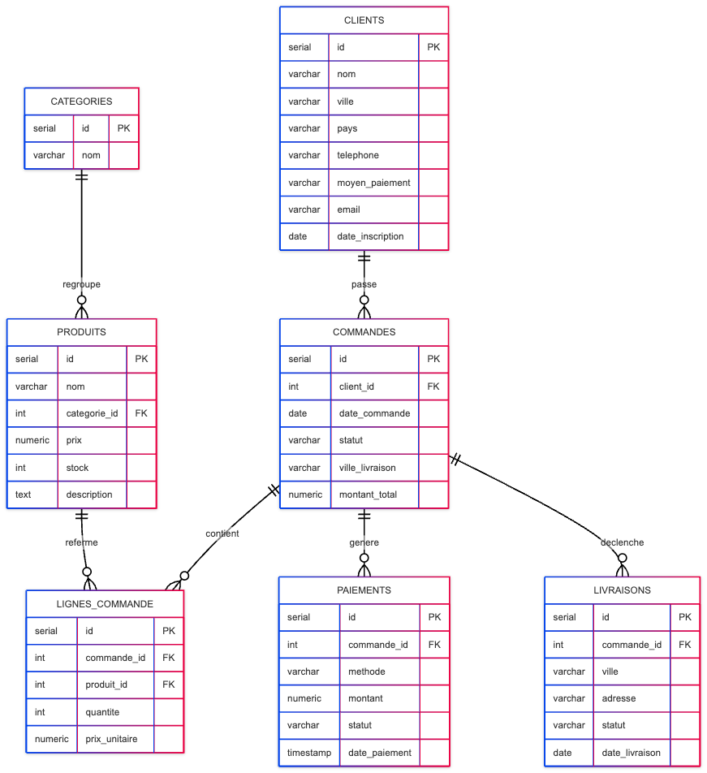
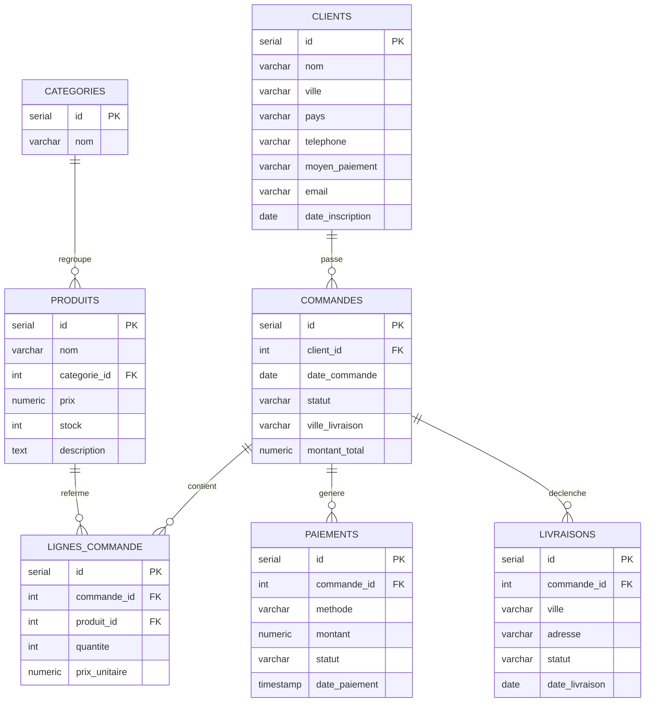

# ERD — MohdataShop (PostgreSQL)

Diagramme entité-relation du schéma actuellement en base (MLD), 7 tables.
Source éditable : `erd_mohdatashop.mermaid`

Voir le code mermaid source

`clients.moyen_paiement` — décision N4 (migration 002) : préférence déclarative uniquement. Source de vérité transactionnelle : `paiements`.
