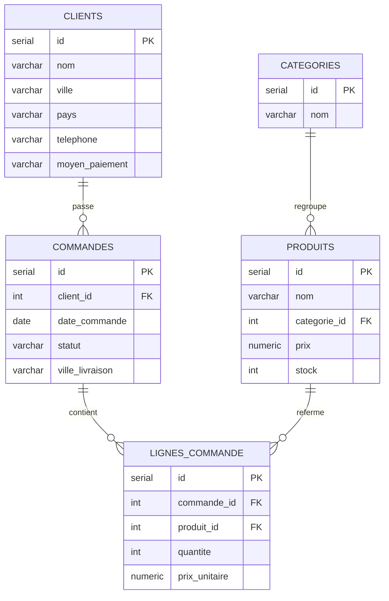

# ERD — MohdataShop (PostgreSQL)

Diagramme entité-relation du schéma actuellement en base (MLD).
Source éditable : `erd_mohdatashop.mermaid`

⚠️ `clients.moyen_paiement` — à réévaluer (cf. `README.md`, section Schéma de base de données).
